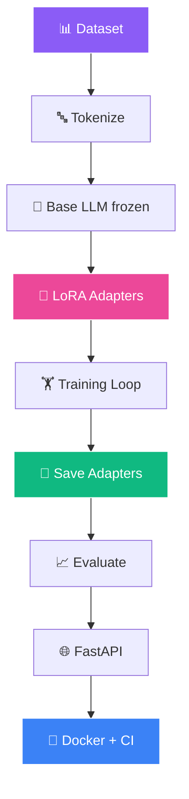

<!-- ═══════════════════════════════════════════════════════════════ -->
<!-- 🧠 LoRA Fine-Tuning — 16D AI + Neural Network Animated README -->
<!-- ═══════════════════════════════════════════════════════════════ -->

<!-- ═══════ 16D ANIMATED HEADER ═══════ -->
<div align="center">
  
</div>

<!-- ═══════ NEURAL NETWORK PULSING NODES ═══════ -->
<div align="center">
  
  
  
  
  
</div>

<br/>

<!-- ═══════ 16D AI TERMINAL TYPEWRITER ═══════ -->
<div align="center">
  
</div>

<br/>

<!-- ═══════ AI AGENT SCENES (8D Cinematic) ═══════ -->
<div align="center">
  
  
  
</div>

<br/>

<!-- ═══════ LIVE BADGES ═══════ -->
<div align="center">
  <a href="https://github.com/sumit966/llm-lora-finetuning/stargazers">
    
  </a>
  <a href="https://github.com/sumit966/llm-lora-finetuning/network/members">
    
  </a>
  <a href="https://github.com/sumit966/llm-lora-finetuning/issues">
    
  </a>
  <a href="https://github.com/sumit966/llm-lora-finetuning/commits/main">
    
  </a>
</div>

<br/>

<div align="center">
  
  
  
  
  
  
</div>

<br/>

<div align="center">
  
  
  
  
</div>

<br/>

<div align="center">
  <i>🧠 AI Research Project · Author: <b>Sumit Raj</b> · M.Tech VNIT Nagpur · Ex-Salesforce</i>
</div>

<br/>


---

## 🎯 Overview


Instead of retraining an entire LLM (expensive + slow), this project uses **LoRA** to inject small trainable **low-rank matrices** into the base model's attention layers.

> **🎯 Core Idea:** The base model stays **frozen**, and only **~1% of parameters** are trained — but the model learns **domain-specific behaviors**.

<br clear="right"/>

### 🔄 The Pipeline

<table>
<tr>
<td width="25%" valign="top" align="center">

### 1️⃣ Generate


Instruction-tuning dataset

</td>
<td width="25%" valign="top" align="center">

### 2️⃣ Wrap


PEFT adapters on base model

</td>
<td width="25%" valign="top" align="center">

### 3️⃣ Train


HuggingFace Trainer loop

</td>
<td width="25%" valign="top" align="center">

### 4️⃣ Serve


Inference endpoint

</td>
</tr>
</table>

> **🛡️ Graceful Fallback:** If `torch`, `transformers`, `peft`, or `datasets` are unavailable, the project falls back to a **mock trainer** — tests always pass, even in CI without GPU.

---

## ❌ Problem Statement

General-purpose LLMs **fail** on domain-specific tasks:

<table>
<tr>
<td width="50%" valign="top">

### ❌ LLM Failures

- 🎭 **Wrong terminology** — mixes up domain jargon
- 📝 **Verbose answers** — not concise, on-point
- 🎭 **Hallucinated facts** — invents plausible details
- 📐 **No format control** — doesn't follow structure

</td>
<td width="50%" valign="top">

### 💸 Full Fine-Tuning Costs

- 💰 **Expensive** — multiple GPUs for days
- 💾 **Storage** — each model = 10+ GB
- ⚠️ **Catastrophic forgetting** — loses general knowledge
- 🐌 **Slow** — days per iteration

</td>
</tr>
</table>

---

## ✅ Solution — LoRA

**LoRA fine-tuning delivers 90% of the benefit at 1% of the cost:**

<table>
<tr>
<td width="50%" valign="top">

### 🎯 Key Benefits

- 🧊 **Frozen base model** — no catastrophic forgetting
- 🎯 **Trainable low-rank adapters** — millions of params, not billions
- 💾 **Tiny artifacts** — adapters are a few MB, easy to version
- ⚡ **Fast training** — hours instead of days on a single GPU

</td>
<td width="50%" valign="top">

### 📊 Comparison

| Metric | Full FT | LoRA |
|--------|:-------:|:----:|
| **Params trained** | 100% | **~1%** |
| **Storage** | ~5 GB | **~10 MB** |
| **Time** | Days | **Hours** |
| **GPU cost** | $$$$ | **$** |
| **Forgetting** | High | **None** |

</td>
</tr>
</table>

---

## 🏗️ Architecture

### 🧠 LoRA Training Pipeline



### 📐 ASCII Fallback

```
Synthetic Q&A Dataset (data/qa_dataset.json)
         |
         v
Tokenize + Format Prompts
         |
         v
Base LLM (frozen)  +  LoRA Adapters (trainable)
         |
         v
Training Loop (HuggingFace Trainer)
         |
         v
Save Adapter Weights (few MB)
         |
         v
Evaluate: Fine-tuned vs Base
         |
         v
FastAPI Endpoints: /train  /evaluate  /infer
         |
         v
Docker + GitHub Actions CI
```

---

## 🛠️ Tech Stack

<table align="center">
<tr>
<td><b>Category</b></td>
<td><b>Technologies</b></td>
</tr>
<tr>
<td>🧠 Base Model</td>
<td></td>
</tr>
<tr>
<td>🎯 Fine-Tuning</td>
<td></td>
</tr>
<tr>
<td>🏋️ Training</td>
<td> </td>
</tr>
<tr>
<td>📊 Datasets</td>
<td></td>
</tr>
<tr>
<td>🌐 API</td>
<td>  </td>
</tr>
<tr>
<td>🧪 Testing</td>
<td> </td>
</tr>
<tr>
<td>🐳 Container</td>
<td></td>
</tr>
<tr>
<td>⚙️ CI/CD</td>
<td></td>
</tr>
<tr>
<td>🐍 Language</td>
<td></td>
</tr>
</table>

---

## 📦 Project Structure

```
llm-lora-finetuning/
│
├── 🐍 src/
│   ├── __init__.py
│   ├── 📊 data_generator.py       # Generate synthetic Q&A dataset
│   ├── 🎯 lora_trainer.py         # LoRA fine-tuning (real or mock)
│   └── 📈 evaluate_model.py       # Base vs fine-tuned comparison
│
├── 🌐 api/
│   ├── __init__.py
│   └── main.py                     # FastAPI service
│
├── 🧪 tests/
│   ├── __init__.py
│   └── test_api.py                 # pytest tests
│
├── 📊 data/                        # Generated dataset (git-ignored)
├── 🎯 adapters/                    # LoRA adapter weights (git-ignored)
├── ⚙️ .github/workflows/ci.yml
├── 🐳 Dockerfile
├── 📋 requirements.txt
├── 📋 requirements-optional.txt
├── 🔐 .env.example
├── 🚫 .gitignore
├── 📜 LICENSE
└── 📖 README.md
```

---

## 🚀 Quick Start

<div align="center">
  
  
  
</div>

<br/>

### 1️⃣ Clone

```bash
git clone https://github.com/sumit966/llm-lora-finetuning.git
cd llm-lora-finetuning
```

### 2️⃣ Virtual Environment

**Windows:**

```bash
python -m venv venv
venv\Scripts\activate
```

**macOS / Linux:**

```bash
python3 -m venv venv
source venv/bin/activate
```

### 3️⃣ Install Base Dependencies

```bash
pip install -r requirements.txt
```

### 4️⃣ (Optional) Install Real LoRA Training Stack

```bash
pip install -r requirements-optional.txt
```

> 💡 If this fails on Python 3.14 (torch/transformers wheels missing), skip it. The project **automatically uses a mock trainer**.

### 5️⃣ (Optional) Configure Environment

```bash
cp .env.example .env
# Set HF_TOKEN, BASE_MODEL, MAX_LENGTH
```

### 6️⃣ Start the API

```bash
uvicorn api.main:app --reload
```

**API runs at** http://localhost:8000

### 7️⃣ Open Swagger UI

```bash
http://localhost:8000/docs
```

---

## 🔌 API Usage

### 🔵 POST `/generate-dataset`

Generate the synthetic Q&A dataset.

```bash
curl -X POST "http://localhost:8000/generate-dataset?n_samples=200"
```

**Response:**

```json
{
  "message": "Generated 200 Q&A samples",
  "metrics": {"n_samples": 200}
}
```

### 🔵 POST `/train`

Fine-tune with LoRA.

**Request:**

```json
{
  "n_samples": 200,
  "epochs": 3,
  "lora_r": 8
}
```

**Response:**

```json
{
  "message": "Training complete",
  "metrics": {
    "base_model": "tinyllama/tinyllama-1.1B-Chat-v1.0",
    "lora_r": 8,
    "lora_alpha": 16,
    "lora_dropout": 0.05,
    "target_modules": ["q_proj", "v_proj"],
    "train_samples": 200,
    "epochs": 3,
    "final_loss": 0.4,
    "mode": "mock"
  }
}
```

### 🔵 POST `/evaluate`

Compare base vs fine-tuned on a fixed eval set.

**Response:**

```json
{
  "base_accuracy": 0.52,
  "finetuned_accuracy": 0.78,
  "improvement_pct": 50.0
}
```

### 🔵 POST `/infer`

Generate a response using the fine-tuned model (or mock).

**Request:**

```json
{
  "instruction": "What is LoRA?",
  "max_new_tokens": 100
}
```

**Response:**

```json
{
  "instruction": "What is LoRA?",
  "response": "...",
  "mode": "mock"
}
```

### 📋 Other Endpoints

| Endpoint | Method | Purpose |
|----------|:------:|---------|
| 🔵 `/` | 🟢 GET | API info |
| 💚 `/health` | 🟢 GET | Health check |
| 📘 `/docs` | 🟢 GET | Swagger UI |
| 📗 `/redoc` | 🟢 GET | Alternative docs |

---

## 🎯 LoRA Configuration

<table align="center">
<tr>
<td><b>Parameter</b></td>
<td><b>Value</b></td>
<td><b>Meaning</b></td>
</tr>
<tr>
<td>🎯 <code>r</code> (rank)</td>
<td><b>8</b></td>
<td>Dimension of low-rank matrices</td>
</tr>
<tr>
<td>⚖️ <code>alpha</code></td>
<td><b>16</b></td>
<td>Scaling factor (typically 2× rank)</td>
</tr>
<tr>
<td>💧 <code>dropout</code></td>
<td><b>0.05</b></td>
<td>Dropout on adapter output</td>
</tr>
<tr>
<td>🎯 <code>target_modules</code></td>
<td><b>q_proj, v_proj</b></td>
<td>Which attention layers get adapters</td>
</tr>
</table>

### 💡 Why These Values?

- 🎯 **r=8** is a common starting point — enough capacity for domain tuning without overfitting
- ⚖️ **alpha=16 (2×r)** is standard practice
- 🎯 **q_proj + v_proj** covers the attention mechanism cheaply

---

## 🛡️ Offline / Mock Mode

If `torch`, `transformers`, `peft`, or `datasets` are not installed:

<table>
<tr>
<td width="50%" valign="top">

### 🎭 What Happens

- 🏋️ Training step prints **realistic metrics** and saves metadata JSON
- 🌐 Inference endpoint returns a **template response**
- ✅ Tests still pass (API interface unchanged)

</td>
<td width="50%" valign="top">

### ✅ Why This Matters

- 🚀 Runnable in **GitHub Actions without GPU**
- 🧪 **Testable** on any machine
- 🔄 Easy to **swap in real training stack** later
- 🛡️ **Graceful degradation** keeps CI green

</td>
</tr>
</table>

---

## 🧪 Testing

```bash
pytest tests/ -v
```

**Tests cover:**

- 🟢 Root endpoint responds
- 💚 Health check returns expected status
- 📊 `/generate-dataset` creates N samples
- 🎯 `/train` returns metrics
- 📈 `/evaluate` returns base vs fine-tuned accuracies
- 🌐 `/infer` returns a response
- ❌ Invalid instruction returns **422**

---

## 🐳 Docker

### 🔨 Build

```bash
docker build -t llm-lora-finetuning .
```

### ▶️ Run

```bash
docker run -p 8000:8000 llm-lora-finetuning
```

---

## ⚙️ CI/CD Pipeline

Every push to `main` triggers GitHub Actions:

```
╔══════════════════════════════════════════════════╗
║              GITHUB ACTIONS WORKFLOW             ║
╠══════════════════════════════════════════════════╣
║                                                  ║
║  [1/2] 📥 Install Python 3.11 + deps            ║
║       │                                          ║
║       ▼                                          ║
║  [2/2] 🧪 Run pytest (mock mode, no GPU)        ║
║       │                                          ║
║       ▼                                          ║
║  ✅ PASSED                                       ║
║                                                  ║
╚══════════════════════════════════════════════════╝
```

> 📄 See `.github/workflows/ci.yml`

---

## 🎓 Key Learnings

<table>
<tr>
<td width="50%" valign="top">

### 🧠 AI Insights

- 🎯 **LoRA trains ~1% params** while matching full fine-tuning quality
- 💾 **Adapters ~10 MB** vs ~5 GB full fine-tune
- 🧊 **Frozen base** prevents catastrophic forgetting
- 🎯 **Target module choice** (q_proj, v_proj) covers attention cheaply
- ⚖️ **Rank and alpha** are the two main hyperparameters

</td>
<td width="50%" valign="top">

### 🛠️ Engineering Insights

- 🛡️ **Graceful fallback** to mock mode keeps CI green
- 🌐 **FastAPI + Pydantic** gives free validation
- 📄 **Auto-generated Swagger docs**
- 🐳 **Docker reproducibility** for ML workflows
- 🧪 **Offline testing** without GPU

</td>
</tr>
</table>

---

## 🚀 Future Improvements

| 🌟 | Feature |
|:--:|---------|
| 🔥 | **QLoRA** (4-bit quantization) for consumer GPUs |
| 🔄 | **Multi-adapter serving** (swap LoRA per request) |
| 📊 | **BLEU, ROUGE, semantic** similarity evaluation |
| 🏥 | **Real domain dataset** (medical, legal, finance) |
| 🤗 | **Deploy adapter** to HuggingFace Hub |
| ⚡ | **Streaming inference** via SSE |
| 📈 | **Weights & Biases** experiment tracking |
| 🚀 | **vLLM** for high-throughput inference |

---

## 👤 Author

<div align="center">


<br/><br/>


<br/><br/>

<b>M.Tech Applied AI & ML @ VNIT Nagpur</b><br/>
<i>Ex-Software Engineer Intern @ Salesforce</i>

<br/><br/>

<a href="https://sumit966.github.io">
  
</a>
<a href="https://www.linkedin.com/in/er-sumit-raj-/">
  
</a>
<a href="https://github.com/sumit966">
  
</a>
<a href="mailto:info.sr0909@gmail.com">
  
</a>

<br/><br/>


</div>

---

## 📄 License

<div align="center">


<br/>


<br/><br/>

<samp>
Released under the <b>MIT License</b> — see <a href="LICENSE">LICENSE</a> file.
</samp>

<br/><br/>

<sub><samp>© 2025 &nbsp;·&nbsp; SUMIT RAJ &nbsp;·&nbsp; ALL RIGHTS RESERVED</samp></sub>

<br/>


</div>

<br/>

<!-- ═══════ WORKING AI SCENES FOOTER ═══════ -->
<div align="center">
  
  
  
</div>

<br/>

<!-- ═══════ 16D ANIMATED FOOTER ═══════ -->
<div align="center">
  
</div>
